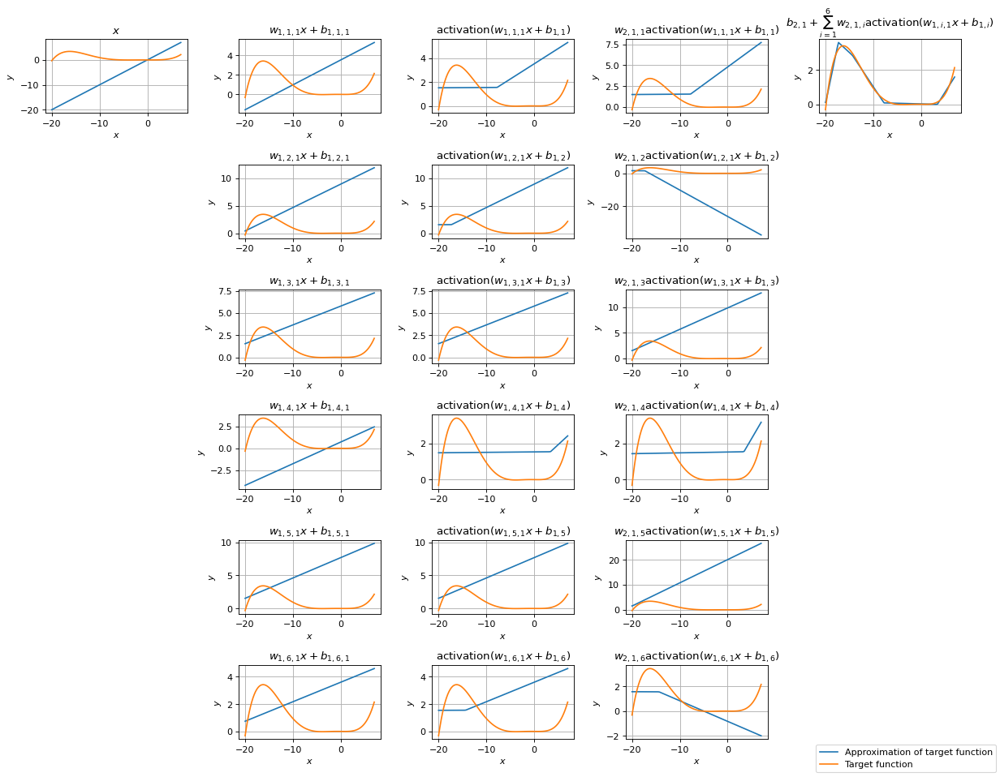
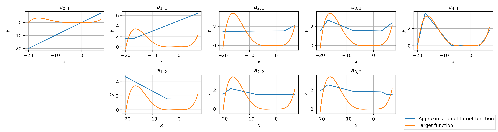

# Interactive Artificial Neural Network Function Approximation Demonstration

This [notebook](https://colab.research.google.com/github/ESandML/ANN-Demo/blob/main/ANN_Demo.ipynb) is provided as a learning resource to aid students of machine learning in understanding artificial neural networks (ANNs).

With this resource, you are able to visualise an animation of the approximation of a known target function, modelled by an ANN, as the network is trained on synthetic data representing the target function, as well as decompositions of the final approximation. In this, you can experiment with different data and hyperparameters, such as the number of hidden layers, the number of hidden neurons, and the activation function, allowing for interactive learning. The visualisations are based on real Python code for training neural networks that is built in PyTorch, a popular library for deep learning, providing an accessible insight into the tools used to build today's advanced artificial intelligence systems.

To get started, simply jump in and follow the guidance in the notebook. Additionally, see below for examples of how the notebook can be used for interactive and explorative learning.

## Animation of function approximated by an ANN throughout training

Fig. 1 shows example animations of the approximation of a known target function, modelled by an ANN, as the network is trained on synthetic data representing the target function, as allowed for by this resource. To demonstrate how this can be used for interactive and explorative learning, each animation shown is for a shallow neural network with 16 hidden neurons and the same initial weights, but different activation functions.

  
  
    
  
  
    
  
  
    
	<em>
		Figure 1: Example animations of the approximation of a known target function, modelled by an ANN, as the network is trained on synthetic data representing the target function. Each animation is for a shallow neural network with 16 hidden neurons and the same initial weights, but different activation functions. Top to bottom, left to right: Sigmoid, Tanh, ReLU, LeakyReLU, PReLU, ELU, GELU, CELU, Mish.
	</em>

## Visualisation of a detailed decomposition of approximation of target function by a shallow neural network

Fig. 2 shows an example visualisation of a detailed decomposition of an approximation modelled by an shallow neural network with 6 hidden neurons and the LeakyReLU activation function. We can see: the output of the input neuron $x$; the preactivation output of the $i^{th}$ neuron of the hidden layer $w_{1,i,1}x+b_{1,i}$ for $i \in$ $`\{1,2,\ldots,6\}`$, where $w_{1,i,1}$ is the weight and $b_{1,i}$ is the bias; the postactivation output of the $i^{th}$ hidden neuron $\mathrm{LeakyReLU}(w_{1,i,1}x+b_{1,i})$; the multiplication of the postactivation output of the $i^{th}$ hidden neuron by the corresponding weight in the output neuron $w_{2,1,i}\mathrm{LeakyReLU}(w_{1,i,1}x+b_{1,i})$; and the output of the output neuron $b_{2,1} + \sum\limits_{i=1}^6 w_{2,1,i}\mathrm{LeakyReLU}(w_{1,i,1}x+b_{1,i})$.

    
	<em>
		Figure 2: Example visualisation of a decomposition of an approximation modelled by an shallow neural network with 6 hidden neurons and the LeakyReLU activation function.
	</em>

## Visualisation of a less-detailed decomposition of approximation of target function by an MLP

Fig. 3 shows an example visualisation of a less-detailed decomposition of an approximation modelled by a multilayer perceptron (MLP) with 3 hidden layers, each containing 2 neurons, and the LeakyReLU activation function. We can see: the output of the input neuron $a_{0,1}$; the output of the $j^{th}$ neuron of the $i^{th}$ hidden layer $a_{i,j}$ for $i \in$ $`\{1,2,3\}`$ and $j \in$ $`\{1,2\}`$; and the output of the output neuron $a_{4,1}$.

    
	<em>
		Figure 3: Example visualisation of a less-detailed decomposition of an approximation modelled by an MLP with 3 hidden layers, each containing 2 neurons, and the LeakyReLU activation function.
	</em>

